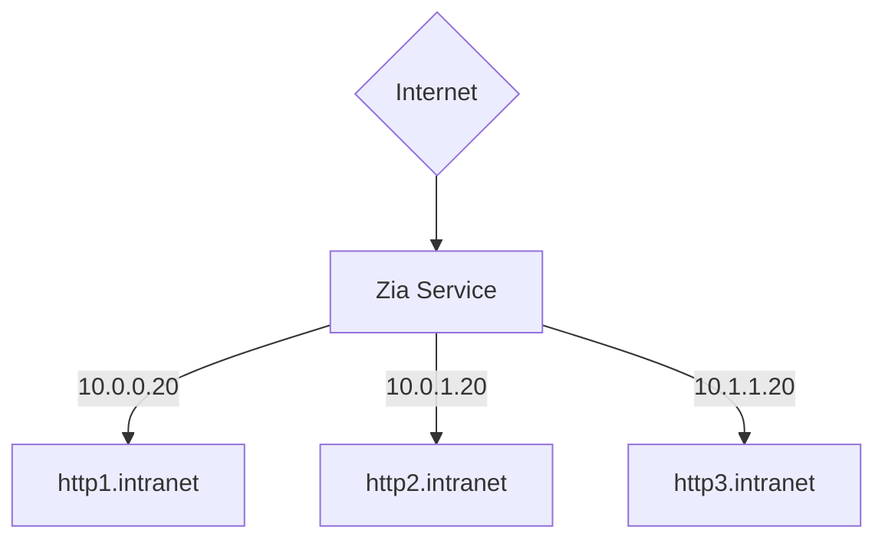

# Zia

### just a simple reverse proxy

version: 0.0.4 beta

Zia is a reverse proxy written in go language. I needed a simple and fast reverse proxy to acces some old docker containers.

##### ToDo

- https mode with valid certificate - let's encrypt
- some statistics
- color mode cli
- limit connections

##### Features

- reverse proxy
- simple json config file
- https mode with self-signed certificate

###### requirements:

- golang installed
- ipv4 network

#### Installing Zia

build the code, `make zia` and run `sudo make install`
rename config_sample.json to config.sample and edit the config

to have zia work on ports below 1024
`sudo setcap CAP_NET_BIND_SERVICE=+eip zia`

Config format:

```json
{
  "service": {
    "ssl": true,
    "port": 80,
    "hostname": "your.host.name"
  },
  "domains": {
    "host": "test.local",
    "target": "http://127.0.0.1:8081"
  }
}
```

### Service

contains settings about the zia frontend, ssl, tcp port to listen and hostname.
Hostname can't be an IP so be shure is resolvable by your host - either set in /etc/hosts or windows/system32/...etc/hosts
ssl option default is false, enable it only if you have a ssl certificate in config/cert/ folder
Certificate

### Domains

containe settings about backend - where to redirect the request.
host is the hostname - make shure the host where zia runs know's the host
target is the url of the backend

##### ssl gen

Makefile has this already, edit makefile with your own data then run ` make ssl`

Or you can do it manually:

```bash
cd config/cert
openssl genrsa -out ziaca.key 4096
openssl req -new -x509 -days 3650 -key ziaca.key -out ziacert.pem -subj "/C=DE/ST=B/L=Berlin/O=Zia/OU=IT/CN=ZiaRootCA"
```

##### Scheme


